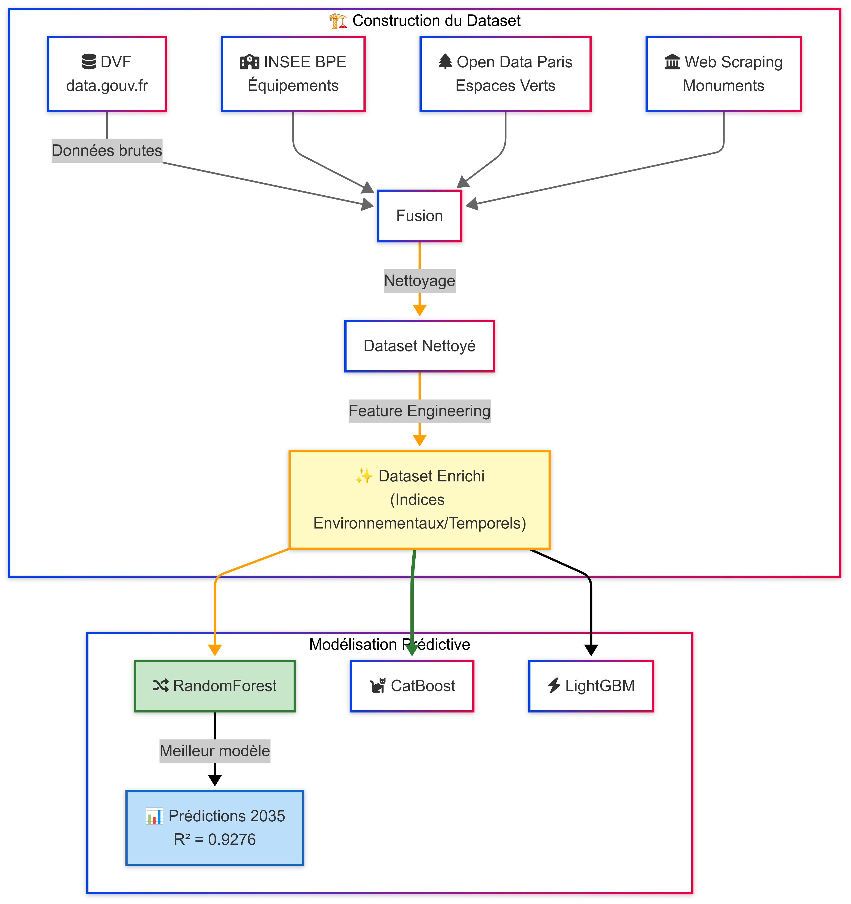
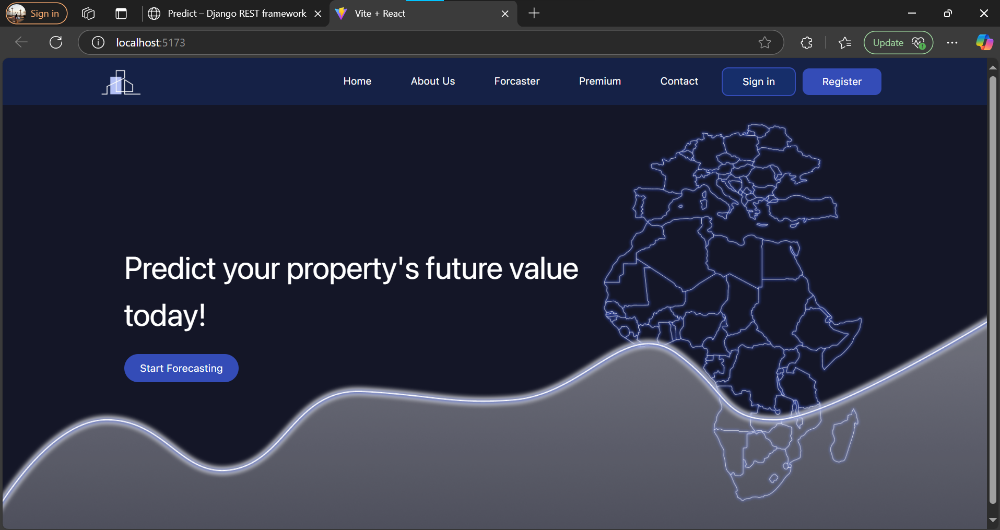
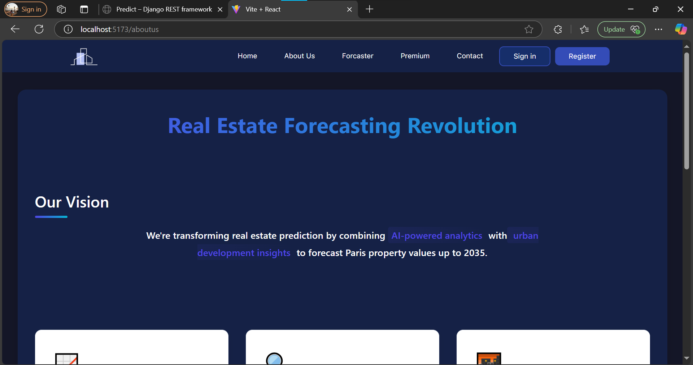
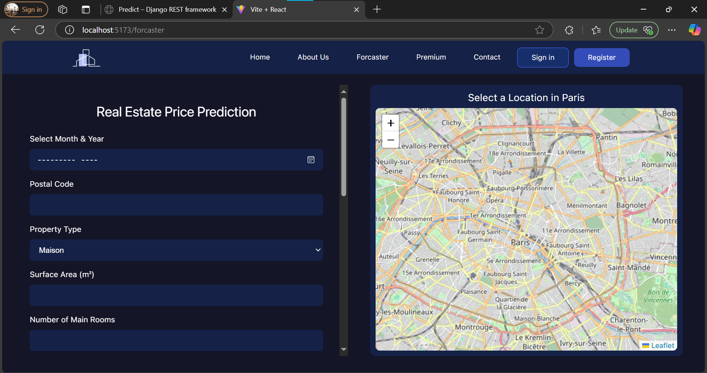
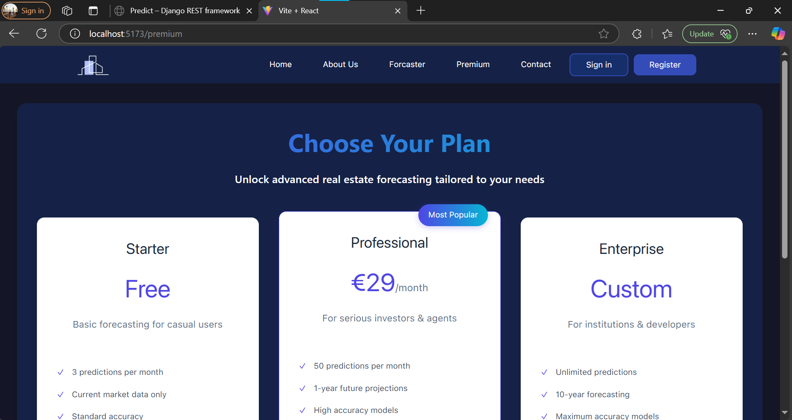
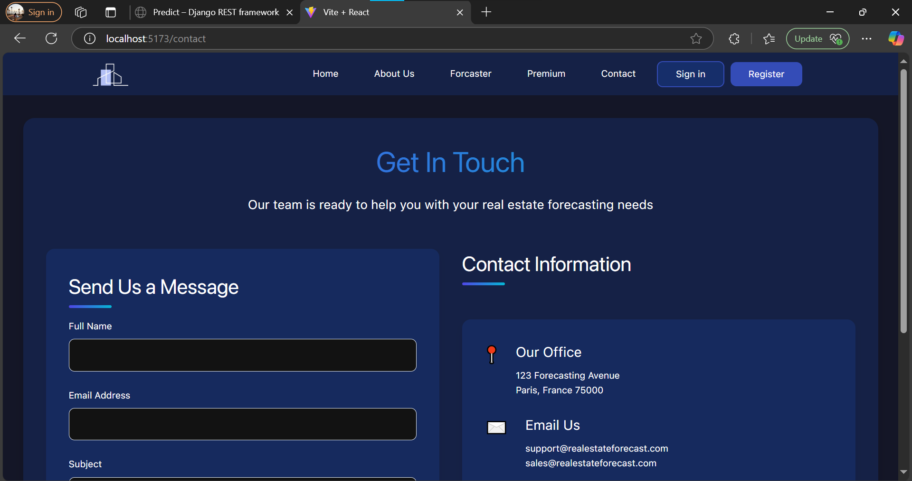
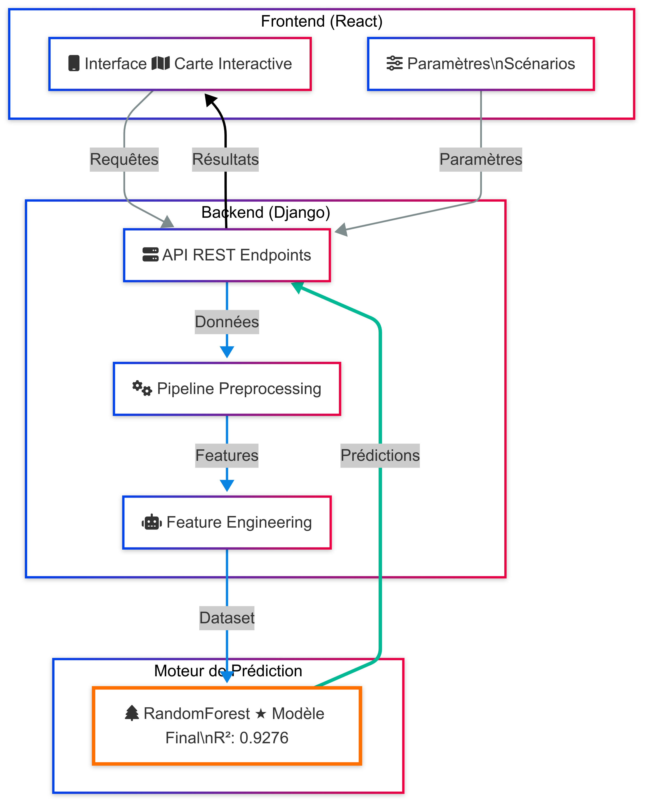

<a name="top"></a>

# 🏙️ Real Estate Price Forecasting – Paris

Ce projet vise à prédire les prix de l'immobilier à Paris à l'aide de modèles de machine learning, en combinant des données ouvertes, des indicateurs géographiques, et une carte interactive pour une expérience utilisateur enrichie. L'application est développée avec un **frontend React**, un **backend Django REST API**, et des **modèles prédictifs** entraînés en Python.

## Ressources Complémentaires

Certains fichiers volumineux n'étant pas déployés sur GitHub, la version complète du projet (incluant tous les fichiers massifs) est disponible sur [Google Drive](https://drive.google.com/drive/folders/11jk841V25g2KRRz8eLMpLn1c2yFzu4Fh?usp=sharing).  
N'hésitez pas à y accéder pour obtenir l'intégralité des ressources.

## Démonstration Video

Une vidéo démonstrative est disponible pour illustrer l’interprétation des résultats dans l’interface utilisateur, après le lancement de l’application.

[Cliquez ici pour visionner la vidéo](https://drive.google.com/drive/folders/168jv6-dKZHcKB2Hs1L5OPzBMldsLZDuJ?usp=drive_link)

## 📑 Table des Matières

1. [Introduction](#1-introduction)  
  1.1 [Objectifs du Projet](#11-objectifs-du-projet)  
  1.2 [Description Générale](#12-description-générale)  
  1.3 [Diagramme de Cas d'Utilisation](#13-diagramme-de-cas-dutilisation)  
  1.4 [Diagramme de Classe](#14-diagramme-de-classe)

2. [Technologies et Outils Utilisés](#2-technologies-et-outils-utilisés)  
  2.1 [Stack Technique](#21-stack-technique)  
  2.2 [Librairies et APIs](#22-librairies-et-apis)  

3. [Construction du Dataset](#3-construction-du-dataset)  
  3.1 [Sources de Données](#31-sources-de-données)  
  3.2 [Web Scraping](#32-web-scraping)  
  3.3 [Fusion et Prétraitement](#33-fusion-et-prétraitement)  
  3.4 [Feature Engineering](#34-feature-engineering)  

4. [Modélisation Prédictive](#4-modélisation-prédictive)  
  4.1 [Choix des Modèles](#41-choix-des-modèles)  
  4.2 [Entraînement et Validation](#42-entraînement-et-validation)  
  4.3 [Évaluation des Performances](#43-évaluation-des-performances)  

5. [Backend – API Django](#5-backend--api-django)  
  5.1 [Architecture de l’API](#51-architecture-de-lapi)  
  5.2 [Endpoints Clés](#52-endpoints-clés)  
  5.3 [Communication avec le Frontend](#53-communication-avec-le-frontend)  

6. [Frontend – Application React](#6-frontend--application-react)  
  6.1 [Interface Utilisateur](#61-interface-utilisateur)  
  6.2 [Connexion à l’API](#62-connexion-à-lapi)  
  6.3 [Design Responsive](#63-design-responsive)  
  6.4 [Captures d’écran](#64-captures-décran)


7. [Carte Interactive](#7-carte-interactive)  
  7.1 [Objectif](#71-objectif)  
  7.2 [Fonctionnalités](#72-fonctionnalités)  
  7.3 [Technologies Utilisées](#73-technologies-utilisées)

8. [Installation et Configuration](#8-installation-et-configuration)

9. [Conclusion](#9-conclusion)

---

## 1. Introduction

### 1.1 Objectifs du Projet

Ce projet a pour ambition de dépasser les limites classiques des modèles de prédiction immobilière en proposant une solution intelligente et prospective, capable **d’anticiper l’évolution des prix de l’immobilier à Paris sur les 10 prochaines années**.  
Les objectifs sont les suivants :

- **Prédire les prix futurs** de l’immobilier à court et moyen terme (jusqu’à 2035), en intégrant non seulement les données actuelles, mais aussi les **projets d’aménagement à venir**, **les politiques publiques**, et **les investissements urbains planifiés**.
- Exploiter les **open data** et les **informations extraites de sites gouvernementaux** (PLU, projets de construction, rénovations urbaines, etc.) via des techniques de **web scraping** pour enrichir la base de connaissance.
- Tenir compte des **facteurs d’influence futurs** (nouvelles lignes de transport, construction d’écoles, zones commerciales, parcs, etc.) afin de modéliser les dynamiques territoriales ayant un impact potentiel sur la valeur foncière.
- Offrir un outil d’aide à la décision prédictif et interactif, à destination des investisseurs, urbanistes, citoyens et acteurs publics.

### 1.2 Description Générale

Contrairement aux projets classiques de prédiction immobilière qui s’appuient uniquement sur les tendances passées et présentes, cette solution propose une approche innovante orientée vers le **futur du territoire parisien**.

L’architecture du projet repose sur trois piliers :

- **Une plateforme backend Django**, qui gère la logique de prédiction, expose des endpoints API REST, et orchestre l’ensemble des flux de données entre les composants.
- **Une interface frontend en React**, intuitive, responsive et mobile-first (design inspiré de Figma), qui permet à l’utilisateur de simuler l’évolution des prix dans différents contextes urbains.
- **Un moteur de modélisation avancée**, basé sur des algorithmes robustes comme **CatBoost**, **LightGBM** et **RandomForest**, enrichi par un travail poussé de **feature engineering** intégrant des **indicateurs d’urbanisation future**, extraits de sources ouvertes.

Le projet intègre également une **carte interactive intelligente** qui affiche des prédictions géolocalisées et met en évidence les zones à fort potentiel d’évolution. Grâce à une logique de **scénarisation dynamique**, les utilisateurs peuvent explorer les effets des futurs aménagements sur les prix du m², et ainsi anticiper des opportunités d’investissement.

En combinant **données ouvertes, intelligence artificielle et stratégie urbaine**, ce projet vise à devenir une référence en matière de prévision immobilière prospective.

### 1.3 Diagramme de Cas d'Utilisation

**Description**  
Le diagramme de cas d'utilisation ci-dessous représente les principales interactions entre les acteurs du système (Administrateur, Utilisateur) et les fonctionnalités qu'ils peuvent effectuer. Les cas d'utilisation communs à plusieurs acteurs, comme "S'inscrire et se connecter", sont également mis en évidence.

**Diagramme**  
<div align="center" style="display: flex; justify-content: center; align-items: center; text-align: center;">
  
</div>

### 1.4 Diagramme de Classe

**Description**  
Le diagramme de classe ci-dessous illustre la structure du système en montrant les principales classes impliquées dans le projet et leurs relations. Les classes représentent des entités du domaine, telles que les utilisateurs, les prévisions de prix, et les données géographiques, avec les attributs et méthodes associés.

**Diagramme**  
<div align="center" style="display: flex; justify-content: center; align-items: center; text-align: center;">
  
</div>


<div align="right">

[⬆ Back to top](#top)

</div>


---


## 2. Technologies et Outils Utilisés  

### 2.1 Stack Technique

Le projet repose sur une stack technologique moderne et modulaire, pensée pour garantir une séparation claire des responsabilités entre les différentes couches de l’application, tout en assurant maintenabilité, performance et scalabilité.

#### Backend
- 
- 

#### Frontend
- 
- 
- 
- 

#### Outils DevOps et Build
- 
- 
- 
- 

#### Tests et Qualité
- 
- 

#### Outils Supplémentaires
- 
- 

---

### 2.2 Librairies et APIs

Le projet s’appuie sur des bibliothèques performantes pour la data science, le machine learning, la géolocalisation et l’exploitation d’APIs externes pour enrichir les prédictions.

#### Machine Learning et Data Processing
- `pandas`, `numpy` – Manipulation et analyse des données
- `scikit-learn` – Modélisation de base
- `CatBoost`, `LightGBM`, `RandomForest` – Algorithmes avancés pour la régression
- `joblib` – Sérialisation du modèle

#### Visualisation
- `matplotlib`, `seaborn`, `plotly` – Visualisation des données exploratoires et résultats
- `Leaflet` (via React) – Intégration de la carte interactive

#### APIs et Données Externes
- API de géolocalisation inverse pour la récupération de coordonnées (ex: Nominatim)
- APIs gouvernementales et portails d’urbanisme pour l'extraction des projets d’aménagement
- Web scraping (avec `requests`, `BeautifulSoup`, `Selenium`) pour collecter les plans d’urbanisme, les infrastructures futures (écoles, hôpitaux, zones d’activités...)

#### Communication Frontend-Backend
- `Axios` – Communication HTTP entre React et Django REST API
- Django REST Framework – Création des endpoints API robustes

---

Cette combinaison de technologies et de bibliothèques permet de construire une application performante, interactive et surtout innovante dans sa capacité à anticiper l’évolution du marché immobilier parisien.


<div align="right">

[⬆ Back to top](#top)

</div>


---

## 3. Construction du Dataset

Un dataset personnalisé a été construit à partir de données ouvertes et de web scraping pour prédire les prix immobiliers à Paris, en tenant compte de l’environnement urbain (espaces verts, équipements publics, monuments).

## 3.1 Sources de Données

Les sources suivantes ont été utilisées pour collecter les données nécessaires à la construction du dataset :

1. *Données Foncières (DVF)*  
   - *Source :* [data.gouv.fr](https://www.data.gouv.fr/fr/)  
   - *Description :* Ensemble de données publiques sur les valeurs foncières des biens immobiliers à Paris.

2. *Équipements Parisiens*  
   - *Source :* [INSEE - Base BPE](https://www.insee.fr/fr/statistiques/8217525?sommaire=8217537&q=bpe)  
   - *Description :* Informations géolocalisées sur les équipements parisiens tels que les commerces, services, infrastructures sportives et sanitaires.

3. *Espaces Verts*  
   - *Source :* [Open Data Paris - Espaces Verts](https://opendata.paris.fr/explore/dataset/espaces_verts/table/?disjunctive.type_ev&disjunctive.categorie&disjunctive.adresse_codepostal&disjunctive.presence_cloture)  
   - *Description :* Données sur les espaces verts, qui peuvent influencer les prix des biens immobiliers en fonction de leur proximité.

4. *Monuments Parisiens*  
   - *Source :* [Paris J'aime - Monuments](https://parisjetaime.com/article/les-monuments-parisiens-un-patrimoine-exceptionnel-a024)  
   - *Description :* Extraction de données via web scraping sur les monuments historiques de Paris, éléments importants pour l'impact patrimonial.

## 3.2 Web Scraping

Afin d'enrichir notre dataset avec des informations spécifiques non disponibles directement en open data, un processus de web scraping a été mis en place pour récupérer des données sur les monuments parisiens. Ces données ont permis d'intégrer des variables supplémentaires sur le patrimoine architectural de la ville, un facteur influençant potentiellement les prix immobiliers dans les zones proches.

## 3.3 Fusion et Prétraitement

Une fois les différentes sources de données collectées et nettoyées, un processus de fusion a été réalisé pour assembler ces informations en un seul dataset structuré :

- *Nettoyage des Données DVF :* Suppression des valeurs manquantes et des erreurs.
- *Fusion des Données Environnementales :* Association des données géolocalisées des équipements, espaces verts et monuments avec les données foncières en fonction de leur proximité géographique.
- *Prétraitement des Variables :* Formatage des dates, géolocalisation des biens et des équipements, et transformation des données en un format adapté à l’analyse.

## 3.4 Feature Engineering

Dans cette étape, nous avons créé de nouvelles variables à partir des données existantes afin d'enrichir notre modèle prédictif :

- *Création d'Indices Environnementaux :* Par exemple, des indices pour caractériser la densité des espaces verts, la proximité des monuments ou des équipements clés tels que les commerces et les services de santé.
- *Exploitation de Variables Temporelles :* Utilisation des informations temporelles liées à la date de transaction des biens immobiliers pour extraire des tendances et des périodes de fluctuation des prix.
- *Agrégations :* Calcul de la moyenne, de la médiane et de la variance pour les différentes zones géographiques (quartiers, arrondissements) en fonction des équipements et de l'environnement.

Ces nouvelles variables créées ont permis d'enrichir le modèle de prédiction et d'améliorer la performance du modèle d'apprentissage automatique.


<div align="right">

[⬆ Back to top](#top)

</div>


---


# 4. [Modélisation Prédictive](#4-modélisation-prédictive)

Après la construction du dataset enrichi, nous avons appliqué des modèles de machine learning pour prédire les prix immobiliers à Paris. Cette section présente le choix des modèles, l'entraînement, la validation et l'évaluation des performances.

## 4.1 [Choix des Modèles](#41-choix-des-modèles)

Trois modèles de régression ont été sélectionnés pour cette tâche :
- **Random Forest Regressor** : Modèle basé sur l'agrégation de multiples arbres de décision.
- **CatBoost Regressor** : Modèle de gradient boosting optimisé pour des données catégorielles.
- **LightGBM Regressor** : Modèle de boosting, rapide et efficace pour de grandes quantités de données.

Ces modèles ont été évalués sur des versions avec et sans feature engineering pour comparer leurs performances.

## 4.2 [Entraînement et Validation](#42-entraînement-et-validation)

Les modèles ont été entraînés sur un ensemble de données de 80% pour l'entraînement et 20% pour l'évaluation. L’entraînement a inclus un prétraitement des données, l'ajustement des hyperparamètres via validation croisée, et une validation sur un sous-ensemble pour mesurer la performance en temps réel.

## 4.3 [Évaluation des Performances](#43-évaluation-des-performances)

Les performances des modèles ont été mesurées sur l'ensemble de test en utilisant les métriques suivantes :
- **R² (Coefficient de Détermination)**
- **MSE (Erreur Quadratique Moyenne)**
- **MAE (Erreur Absolue Moyenne)**

### Résultats des Modèles :

- **Sans Feature Engineering** : Le modèle **LGBM** sur données encodées a montré les meilleurs résultats avec un **R² de 0.6369**. Toutefois, les erreurs absolues et quadratiques étaient relativement élevées, suggérant une marge d'amélioration.

- **Avec Feature Engineering** : En enrichissant le dataset avec des indices (commerciaux, éducatifs, de santé, etc.), les performances ont nettement progressé. Le modèle **RandomForest** a atteint un **R² de 0.9276**, avec la plus faible **MSE** et **MAE**, surpassant **CatBoost** (R² de 0.9208) et **LightGBM**.

### Choix du Modèle Final :

Au terme de cette analyse, **le modèle RandomForest avec feature engineering est retenu** comme le meilleur choix pour la prédiction des prix immobiliers. Ce modèle a montré la meilleure capacité explicative et les erreurs les plus faibles.

Voici l'architecture complète de la partie machine learning, intégrant la **collecte des données**, le **feature engineering** et la **modélisation** avec le modèle RandomForest sélectionné :

<div align="center" style="text-align: center;">
   
</div>

<div align="right">

[⬆ Back to top](#top)

</div>


---


# 5. Backend – API Django

L'API backend est développée avec Django REST Framework pour gérer la communication entre le frontend et le modèle de machine learning.

## 5.1 Architecture de l’API
L'API repose sur Django pour créer les endpoints RESTful qui traitent les requêtes, exécutent les prédictions et renvoient les résultats au frontend. Elle inclut un modèle de données pour stocker les informations et un module pour gérer les prédictions via le modèle ML.

## 5.2 Endpoints Clés
- **POST /predict/** : Reçoit les données immobilières, effectue une prédiction et renvoie le prix prédit.
- **GET /health/** : Vérifie que l'API fonctionne correctement.
- **GET /model-info/** : Fournit des informations sur le modèle de prédiction utilisé.

## 5.3 Communication avec le Frontend
Le frontend (React) communique avec l'API Django via des requêtes HTTP envoyées avec Axios. Les données sont envoyées en JSON et la réponse contient la prédiction du prix immobilier.


<div align="right">

[⬆ Back to top](#top)

</div>


## 6. Frontend – Application React

Le frontend est développé en React, en se basant sur une maquette Figma initialement conçue pour mobile. L’interface a ensuite été adaptée pour les écrans plus larges, mais sans suivre strictement une approche mobile-first.

### 6.1 Interface Utilisateur
L'application propose une interface simple et intuitive permettant à l'utilisateur de :
- Renseigner les caractéristiques d’un bien immobilier (surface, localisation, type, etc.).
- Lancer la prédiction du prix.
- Visualiser le prix estimé en temps réel.

### 6.2 Connexion à l’API
Le frontend utilise Axios pour communiquer avec l’API Django. Lors de la soumission du formulaire, les données sont envoyées via une requête POST, et le prix prédit est affiché à l’utilisateur.

### 6.3 Design Responsive
Bien que la maquette de départ ait été conçue pour mobile, l’implémentation s’est orientée vers un design responsive, adapté manuellement aux différentes tailles d’écran. Les composants React sont organisés de manière modulaire pour garantir maintenabilité et réutilisabilité.

### 6.4 Captures d’écran
Voici quelques captures de l’interface utilisateur :


<div align="center" style="display: flex; justify-content: center; align-items: center; text-align: center;">
   <h3>Home Page</h3>
   
   <h3>About Us Page</h3>
   
   <h3>Forcaster Page</h3>
   
   <h3>Premium Page</h3>
   
   <h3>Contact Page</h3>
   
   
   
   
</div>


<div align="right">

[⬆ Back to top](#top)

</div>


# 7. Carte Interactive

La carte interactive permet aux utilisateurs d’explorer visuellement les quartiers de Paris et d’accéder aux prédictions de prix en fonction de la localisation.

## 7.1 Objectif
- Fournir une représentation géographique dynamique des biens immobiliers.
- Permettre à l’utilisateur de sélectionner une zone sur la carte pour obtenir une estimation des prix immobiliers.
- Intégrer les données environnementales (proximité des équipements, espaces verts, monuments) dans l’analyse prédictive.

## 7.2 Fonctionnalités
- **Sélection géographique :** Cliquer sur la carte pour définir la localisation du bien.
- **Affichage des prédictions :** Visualiser instantanément le prix prédit pour la zone sélectionnée.
- **Navigation interactive :** Zoomer, dézoomer et parcourir la carte pour explorer différentes zones de Paris.
- **Intégration des indices environnementaux :** Affichage des indicateurs clés (proximité des équipements, espaces verts, etc.) influençant la prédiction.

## 7.3 Technologies Utilisées
- **Leaflet.js / Mapbox GL JS :** Pour le rendu et la manipulation de la carte interactive.
- **React :** Pour l’intégration et la gestion dynamique des composants cartographiques.
- **Axios :** Pour la communication avec l’API backend et la récupération des prédictions en temps réel.

Voici l'architecture complète de notre projet
<div align="center" style="text-align: center;">
   
</div>


<div align="right">

[⬆ Back to top](#top)

</div>


# 9. Installation et Configuration

Instructions pour Faire Fonctionner l'Application

## 1. Lancer le Backend (Django)

### Étape 1 : Accéder au dossier backend

Ouvrez un terminal et naviguez jusqu'au dossier où se trouve le backend de l'application. Par exemple, si votre projet est dans le dossier `RealEstateProject`, allez dans le dossier `backend` :

```bash
cd /chemin/vers/le/dossier/backend
```

### Étape 2 : Activer l'environnement virtuel

Dans le terminal, exécutez la commande suivante pour activer l'environnement virtuel de Python :

```bash
.\venv\Scripts\activate
```

Cela activera l'environnement virtuel et vous permettra d'utiliser les bibliothèques Python nécessaires au fonctionnement de l'application.

### Étape 3 : Lancer le serveur Django
Ensuite, lancez le serveur Django avec la commande suivante :

```bash
python manage.py runserver
```

Cela démarrera le serveur de développement sur le port indiqué dans votre terminal. Vous pouvez maintenant accéder à l'endpoint de prédiction via : http://localhost:<port_indiqué>/api/predict.

## 2. Lancer le Frontend (React)

Ouvrez un autre terminal et naviguez jusqu'au dossier du frontend de l'application. Par exemple :

```bash
cd /chemin/vers/le/dossier/frontend
```

### Étape 2 : Installer les dépendances

Si vous ne l'avez pas encore fait, installez les dépendances nécessaires pour le frontend avec npm (Node Package Manager) :

```bash
npm install
```

### Étape 3 : Démarrer le serveur de développement React
Lancez le serveur de développement pour le frontend avec la commande suivante :

```bash
npm run dev
```

Cela démarrera le serveur React sur le port indiqué dans votre terminal, et vous pourrez accéder à l'interface utilisateur dans votre navigateur.


# 9. Conclusion

Nous avons développé une solution complète pour prédire les prix immobiliers à Paris en combinant des données ouvertes, le web scraping et des techniques avancées de machine learning. La fusion des données foncières, des équipements urbains, des espaces verts et des monuments, enrichie par un travail de feature engineering, a permis de construire un modèle prédictif performant.

L’architecture modulaire de l’application, avec un backend Django exposant une API REST et un frontend React interactif, offre une expérience utilisateur fluide et une grande évolutivité pour intégrer de futures améliorations.

Ce projet illustre comment l’intégration de multiples sources de données et l’utilisation d’approches innovantes permettent d’anticiper l’évolution du marché immobilier sur le long terme.


<div align="right">

[⬆ Back to top](#top)

</div>


## Les Contributeurs
<div style="display: flex; gap: 30px; justify-content: center; align-items: center; text-align: center; flex-wrap: wrap;">
  <div>
    <a href="https://github.com/s4l4h">
      
      <p>BAHAFID Salah Eddine</p>
    </a>
  </div>
  <div>
    <a href="https://github.com/Wissal-Chbani">
      
      <p>CHBANI Wissal</p>
    </a>
  </div>
  <div>
    <a href="https://github.com/Alidou26">
      
      <p>KI Alidou</p>
    </a>
  </div>
  <div>
    <a href="https://github.com/Kahisorow">
      
      <p>SBAI Yahia</p>
    </a>
  </div>
</div>


<div align="right">

[⬆ Back to top](#top)

</div>
